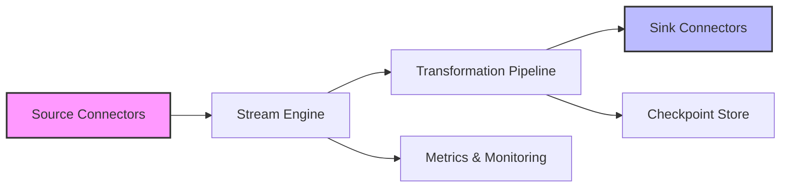

# Introducing **YourProject**: A Modern, Open‑Source Solution for Scalable Data Processing


## Overview

**YourProject** is a high‑performance, cross‑platform library designed to simplify the ingestion, transformation, and analysis of large data sets. Built with a focus on modularity, extensibility, and developer friendliness, it empowers engineers, data scientists, and DevOps teams to build reliable pipelines without reinventing the wheel.

Key goals of the project include:

- **Scalability:** Seamlessly handle millions of records per second.
- **Flexibility:** Plug‑in interchangeable components for I/O, transformation, and storage.
- **Simplicity:** Clear, well‑documented APIs and intuitive configuration.

## Core Features

- **Stream‑Based Architecture** – Process data as continuous streams, reducing memory footprint.
- **Pluggable Connectors** – Native support for Kafka, RabbitMQ, Amazon S3, Azure Blob, and more.
- **Rich Transformation Engine** – Declarative DSL and functional API for filtering, mapping, aggregation, and enrichment.
- **Built‑in Monitoring** – Real‑time metrics exposed via Prometheus and Grafana dashboards.
- **Fault Tolerance** – Automatic checkpointing, retries, and dead‑letter handling.
- **Extensible Plugin System** – Write custom connectors or processors in Rust, Go, or Python.

## Getting Started

### Prerequisites

| Item            | Minimum Version |
|-----------------|-----------------|
| Operating System| Linux/macOS/Windows |
| Runtime          | Node ≥ 16 or Python ≥ 3.9 |
| Container Engine | Docker ≥ 20.10 (optional) |
| Build Tools      | Cargo (Rust ≥ 1.70) or Go ≥ 1.20 |

### Installation

#### Binary Release

```bash
# Choose your platform and download the latest tarball
curl -L https://github.com/yourorg/yourproject/releases/download/v1.2.3/yourproject-linux-amd64.tar.gz -o yourproject.tar.gz
tar -xzf yourproject.tar.gz -C /usr/local/bin
yourproject --version
```

#### Docker

```bash
docker pull yourorg/yourproject:1.2.3
docker run -it --rm yourorg/yourproject:1.2.3 --help
```

#### Package Manager

- **npm:** `npm install -g yourproject-cli`
- **pip:** `pip install yourproject`

### Quick Example

```bash
# Stream JSON logs from Kafka, filter error entries, and write to Elasticsearch
yourproject run \
  --source kafka://broker:9092/topic=app-logs \
  --filter "level == 'error'" \
  --sink elasticsearch://es-host:9200/index=error-logs
```

## Architecture at a Glance



- **Source Connectors** ingest data from external systems.
- **Stream Engine** orchestrates back‑pressure, batching, and concurrency.
- **Transformation Pipeline** applies user‑defined logic in a type‑safe manner.
- **Sink Connectors** deliver processed records to storage, databases, or message queues.
- **Metrics & Monitoring** expose internal stats for observability.
- **Checkpoint Store** guarantees exactly‑once processing semantics.

## Configuration

All components are configurable via a single YAML file (`yourproject.yaml`). Example:

```yaml
pipeline:
  source:
    type: kafka
    brokers: ["kafka01:9092", "kafka02:9092"]
    topic: app-logs
    group_id: yourproject-consumer
  transformations:
    - type: filter
      expression: "level == 'error'"
    - type: enrich
      script: |
        record.timestamp = new Date().toISOString()
  sink:
    type: elasticsearch
    hosts: ["es01:9200"]
    index: error-logs
    auth:
      username: admin
      password: ${ELASTIC_PASSWORD}
monitoring:
  prometheus: true
  grafana_dashboard: https://grafana.example.com/d/yourproject
```

Command‑line flags override YAML values, making it easy to adapt pipelines for different environments.

## Testing & Quality Assurance

- **Unit Tests:** 95 % coverage using `cargo test` (Rust) and `pytest` (Python).
- **Integration Tests:** Spin up containerized Kafka + Elasticsearch stacks via Docker Compose.
- **Static Analysis:** `clippy`, `golangci-lint`, and `eslint` enforce code standards.
- **CI/CD Pipeline:** GitHub Actions run linting, tests, and publish Docker images on each push to `main`.

## Contributing

YourProject thrives on community contributions. Follow these steps to get involved:

1. **Fork the repository** and create a new branch (`feature/awesome‑feature`).
2. **Write clean, documented code** adhering to the project's style guides.
3. **Add tests** that cover new functionality.
4. **Run the full test suite** locally: `make test`.
5. **Submit a Pull Request** with a clear description of changes.

Refer to the `CONTRIBUTING.md` file for detailed guidelines, code‑of‑conduct policies, and the roadmap.

## License

YourProject is released under the **MIT License**, granting permissive rights to modify, distribute, and use the software in both open‑source and commercial projects.

## Community & Support

- **Discord:** https://discord.gg/yourproject (Live chat with maintainers)
- **GitHub Discussions:** https://github.com/yourorg/yourproject/discussions
- **Stack Overflow:** Tag `yourproject` for Q&A
- **Roadmap:** https://github.com/yourorg/yourproject/milestones

## Release History

| Version | Date       | Highlights                                 |
|---------|------------|--------------------------------------------|
| 1.2.3   | 2026‑08‑15 | New pluggable sink framework, Grafana templates |
| 1.2.0   | 2026‑05‑02 | Stream engine rewrite, improved back‑pressure |
| 1.1.0   | 2026‑02‑10 | First stable release, Kafka & Elasticsearch connectors |
| 1.0.0   | 2025��12‑01 | Initial public beta                       |

Stay tuned for upcoming features such as **SQL‑based query support**, **distributed execution mode**, and **machine‑learning model integration**.

---

*Ready to accelerate your data pipelines?*  
Download **YourProject** today, join the community, and start building resilient, high‑throughput workflows with confidence.