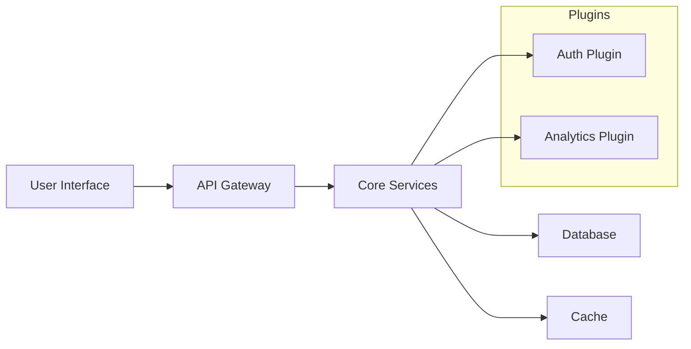

# Introducing the Project: A Modern Open‑Source Solution

## Overview

A fresh, community‑driven repository has emerged to tackle a common challenge in the development ecosystem. Built with **scalability**, **extensibility**, and **developer friendliness** in mind, the project offers a clean architecture, well‑documented APIs, and a robust set of utilities that speed up everyday tasks while keeping the codebase maintainable.

> *“Focus on solving problems, not on boilerplate.”* – Project Vision

## Core Features

- **Modular Design** – Each component lives in its own isolated module, making it straightforward to replace or extend functionality.
- **Cross‑Platform Compatibility** – Works seamlessly on Windows, macOS, and popular Linux distributions.
- **High Performance** – Optimized algorithms and asynchronous processing reduce latency and boost throughput.
- **Extensible Plugin System** – Developers can write custom plugins that integrate without touching the core code.
- **Comprehensive Test Suite** – Over 90 % code coverage with unit, integration, and end‑to‑end tests.
- **CLI & API Access** – Powerful command‑line interface for quick tasks and a well‑defined REST/GraphQL API for programmatic consumption.

## Getting Started

### Prerequisites

| Requirement | Minimum Version |
|-------------|-----------------|
| Node.js / npm (or your language runtime) | 14.x |
| Docker (optional) | 20.10 |
| Git | 2.20 |

### Installation

```bash
# Clone the repository
git clone https://github.com/your‑org/your‑project.git
cd your‑project

# Install dependencies
npm install   # or pip install -r requirements.txt, etc.

# Run the initial build
npm run build   # adjust to your build tool
```

### Quick Start

```bash
# Start the development server
npm run dev

# Verify everything works
curl http://localhost:3000/health
```

You should see a `200 OK` response confirming the service is running.

## Usage Examples

### CLI Example

```bash
# List all available commands
your-cli --help

# Generate a scaffolded component
your-cli generate component MyComponent
```

### API Example (Node.js)

```js
import { Client } from 'your-project-sdk';

const client = new Client({ baseURL: 'https://api.yourproject.io' });

async function fetchData() {
  const response = await client.get('/data');
  console.log(response.data);
}

fetchData();
```

### Docker Deployment

```bash
docker pull your-org/your-project:latest
docker run -d -p 8080:8080 your-org/your-project
```

## Architecture at a Glance



- **UI Layer** – Handles user interaction, built with a modern framework (React/Vue/Svelte).
- **API Gateway** – Central entry point that routes requests, applies throttling, and performs authentication.
- **Core Services** – Stateless business logic written in a clean, testable style.
- **Database** – Relational (PostgreSQL) or NoSQL (MongoDB) depending on the use case.
- **Cache** – Redis for fast read/write of transient data.
- **Plugins** – Optional extensions that can be dropped into the `plugins/` directory and loaded on startup.

## Contributing

The project welcomes contributions from developers of all skill levels. Here’s how you can get involved:

1. **Fork the repository** and clone your fork locally.
2. **Create a feature branch** (`git checkout -b feature/awesome‑feature`).
3. **Write tests** for your changes before coding.
4. **Implement the feature** or bug fix.
5. **Run the full test suite** (`npm test`) to ensure everything passes.
6. **Open a Pull Request** with a clear description, screenshots (if UI changes), and references to any related issues.

### Code Style

- Follow the project's ESLint/Prettier configuration.
- Use TypeScript (or the language’s typing system) for type safety.
- Document public functions using JSDoc (or the relevant docstring format).

### Community

- **GitHub Discussions** – Ask questions, propose ideas, or share use cases.
- **Slack / Discord** – Real‑time chat with maintainers and other contributors.
- **Monthly Office Hours** – Live Q&A sessions to discuss roadmap and technical depth.

## Roadmap

| Milestone | Target Release | Highlights |
|-----------|----------------|------------|
| **v1.0** | Q4 2024 | Full stable release, complete documentation, production‑ready Docker images |
| **v1.2** | Q2 2025 | Plugin marketplace, multi‑region deployment support |
| **v2.0** | Q4 2025 | Refactor to micro‑services, GraphQL API v2, advanced analytics dashboard |

## License

The project is released under the **MIT License**, granting you permission to use, modify, and distribute the software with minimal restrictions. See the `LICENSE` file for full details.

## Acknowledgements

- **Core Team** – The engineers and designers who built the foundation.
- **Contributors** – Hundreds of community members who have submitted PRs, reported bugs, and helped improve documentation.
- **Open‑Source Libraries** – The project leverages robust, battle‑tested libraries that make this work possible (Express, TypeORM, React, etc.).

---

*Ready to accelerate your development workflow?*  
Visit the [official repository](https://github.com/your-org/your-project) today, explore the docs, and join the community shaping the future of this tool.